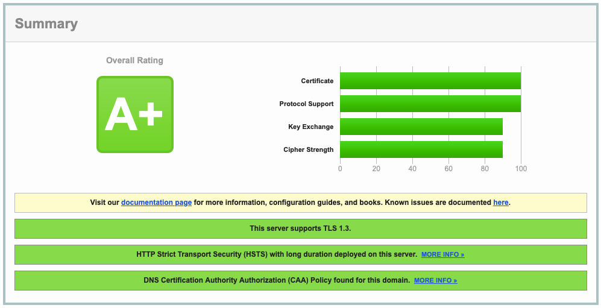

# Installing a Letsencrypt certificate for Zimbra



## TL;DR
Используется [ACME Shell script](https://acme.sh) и метод подтверждения на сервере DNS [Cloudflare](https://cloudflare.com).

## Установка acme.sh 

acme.sh использует socat:

```bash
apt install socat
```
получение и установка acme.sh:

```bash
curl https://get.acme.sh | sh -s email=postmaster@domain.tld
```
Назначим CA по умолчанию:

```bash
~/.acme.sh/acme.sh --set-default-ca --server letsencrypt
```

## Выпуск и установка сертификата
Для взаимодействия с API Cloudflare необходимы [Api Token](https://developers.cloudflare.com/fundamentals/api/get-started/create-token/) или [Global API key](https://developers.cloudflare.com/fundamentals/api/get-started/keys/). Их нужно добавить в переменные окружения:

```bash
export CF_Key="04c5##############################"
export CF_Email="hostmaster@domain.tld"
```
(для Global API key)

### Получение сертификата (domain & wildcard):

```bash
~/.acme.sh/acme.sh --issue --dns dns_cf -d domain.tld -d *.domain.tld
```

### Установка сертификата:

```bash
mkdir -p /opt/zimbra/ssl/letsencrypt \
~/.acme.sh/acme.sh --install-cert -d domain.tld \
--preferred-chain "ISRG Root X1" \
--cert-file /opt/zimbra/ssl/letsencrypt/cert.pem  \
--key-file /opt/zimbra/ssl/letsencrypt/privkey.pem  \
--ca-file /opt/zimbra/ssl/letsencrypt/chain.pem \
--reloadcmd "/root/scripts/zmcert.sh"
```
(проверьте путь до скрипта в последней строке)

Дальнейшее получение и установка сертификата происходят автоматически по расписанию в cron.

## Усиление безопасности Zimbra

### Настройка заголовков HTTP

[HSTS](https://ru.wikipedia.org/wiki/HSTS) и запрет индексирования поисковыми ботами:

```bash
zmprov mcf +zimbraResponseHeader "Strict-Transport-Security: max-age=31536000; includeSubDomains"
zmprov mcf +zimbraResponseHeader "X-Content-Type-Options: nosniff"
zmprov mcf +zimbraResponseHeader "X-Robots-Tag: noindex"
zmprov mcf +zimbraResponseHeader "Referrer-Policy: no-referrer"
zmprov mcf zimbraMailKeepOutWebCrawlers TRUE
zmmailboxdctl restart
```
[Anti-CSRF tokens](https://ru.wikipedia.org/wiki/Межсайтовая_подделка_запроса):

```bash
zmlocalconfig -e zimbra_same_site_cookie="Strict"
zmprov mcf +zimbraCsrfAllowedRefererHosts "mx.mydomain.tld"
```

[Content-Security-Policy (CSP)](https://developer.mozilla.org/ru/docs/Web/HTTP/CSP):

```bash
zmprov mcf +zimbraResponseHeader "Content-Security-Policy: default-src https: 'self' 'unsafe-inline'; script-src https: 'self' 'unsafe-inline' 'unsafe-eval'; object-src 'none'; img-src 'self' data:"
```
Имейте ввиду, директивы типа `unsafe-inline` снижают оценку на [Mozilla Observatory](https://observatory.mozilla.org), т.к. разрешают выполнение inline-скриптов. Кодировать или нет их в Base64, уточните у своей паранойи.

### Links

* https://wiki.zimbra.com/wiki/Cipher_suites
* https://wiki.zimbra.com/wiki/Secopstips